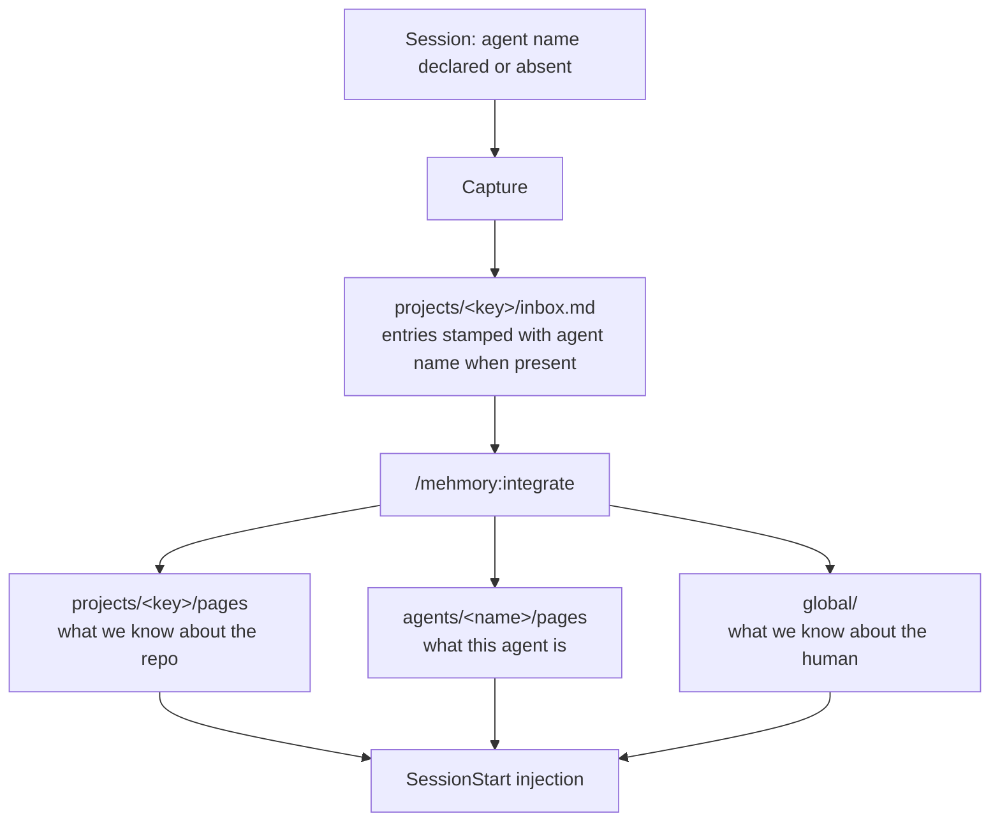
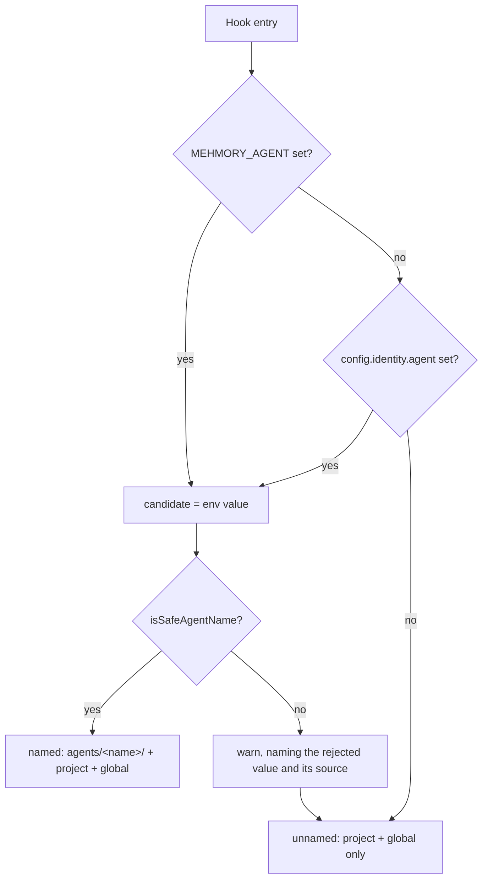
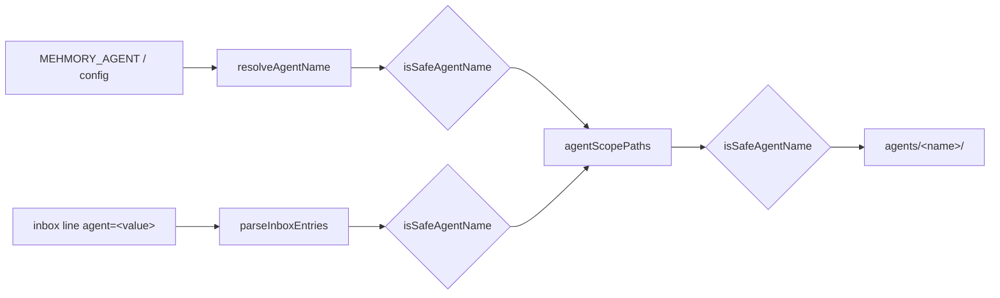

# Agent Scopes - Plan

## Goal Capsule

- **Objective:** Give each agent its own accumulating self — an `agents/<name>/` scope — alongside the project knowledge agents already share, so instances running the same models can diverge into distinct characters.
- **Product authority:** This plan owns the agent scope, its attribution on capture, and its recall. Cleanup of the existing commingled store and any per-agent view of a project are not active scope.
- **Open blockers:** None.
- **Product Contract preservation:** changed: R5 — the safe-key shape it cited (`SAFE_KEY`, `src/core/identity.ts:24`) requires two to five slash-separated segments and structurally cannot accept a single-token agent name. R5 now specifies single-segment validation over the same character class. Its intent — a name can never resolve outside the store root — is unchanged. All other Product Contract content is unchanged.

---

## Product Contract

### Summary

Add a third memory scope, `agents/<name>/`, holding what an agent is: its preferences, style, and non-project knowledge. An agent declares a name, its captures carry that name, and integration routes its self-facts into that scope. An agent with no name keeps working exactly as today and simply has no self.

### Problem Frame

mehmory has one scope axis — the project, keyed from the git remote or a path hash — plus a single `global/` for user-level facts. Capture is keyed by *harness*, not by agent. Two consequences follow.

Agents launched from the same working directory merge into one project scope: the observed case pooled several sessions into `local/7f0bc8cd3379`, the hash of a shared workspace path. And every agent on an enabled harness captures indiscriminately, because agents launched over ACP resolve to the same `claude-code` host as the primary agent, so the per-harness toggle at `config.hosts.<host>` cannot separate them.

Neither has cost anything yet. The pressure is not damage but sameness. Agents learn by doing, and instances that share a model but differ in role or character should not be forced to share what they have learned about themselves. Not every agent needs the same knowledge to be good at its job.

### Key Decisions

- KD1. **A third scope, not a rename.** `global/` stays what it is — facts about the human and their tooling — and the agent scope is added beside it. Collapsing `global/` into the agent scope would break the `--global` purge target, `assets/SCHEMA.md`'s scope rule, and `docs/PRIVACY.md`, and would force a store migration. Governs R2, R9, R13.
- KD2. **No opt-in gate.** Absence of a name means no self, not silence. The feature exists to differentiate agents, not to prevent a leak, so an unnamed agent has no reason to stop contributing project knowledge. Governs R3, R11, R12.
- KD3. **Attribution rides on the entry, not on a separate inbox.** One project inbox stays the single collection point; the agent name is stamped on each entry and integration routes from there. A per-agent inbox would fragment the project knowledge that should stay pooled and split the inbox nudge threshold N ways. Governs R6, R7, R8.
- KD4. **Project knowledge is collaboration, not leakage.** Two agents in one repo read and write one shared project scope by design. Governs R6, R8.
- KD5. **Only named agents pay for the agent scope.** The injection budget grows for a named agent rather than being re-divided, so an unnamed agent's recall is untouched and the cost falls on agents that opted into having a self. Governs R10, R11.

### Actors

- A1. Named agent — an agent with a declared identity. Contributes to and recalls from both the project scope and its own.
- A2. Unnamed agent — an agent with no declared identity. Contributes to and recalls from the project scope and `global/` only.
- A3. Human operator — sets or omits agent names, and reads the store directly with git and grep.
- A4. Integration — the `/mehmory:integrate` pass that drains the inbox into pages and decides which scope each fact belongs to.

### Requirements

**Identity and participation**

- R1. An agent declares its identity by name through the `MEHMORY_AGENT` environment variable, falling back to `config.identity.agent` when that is unset.
- R2. A named agent has an agent scope at `agents/<name>/` holding its own pages and index, distinct from `global/` and from every project scope.
- R3. An agent with no declared name has no agent scope: it neither reads nor writes one, and captures and recalls the project scope and `global/` as it does today.
- R4. One agent name resolves to one agent scope regardless of which harness or surface the session runs on.
- R5. An agent name is validated as a single segment over the same character class project keys use, rejecting `.`, `..`, the empty string, and names reserved by the scope grammar, so a name can never resolve outside the store root. An invalid name is refused rather than rewritten, and the agent is treated as unnamed.

**Capture and routing**

- R6. Every capture continues to append to the project inbox for the resolved project key; no capture path writes into an agent scope directly.
- R7. An inbox entry produced by a named agent carries that name as entry metadata; entries from unnamed agents and entries written before this change carry none and remain parseable.
- R8. Integration routes each entry by subject and attribution — repo facts to the project scope, an agent's self-facts to that agent's scope, facts about the human to `global/` — and never routes an unattributed entry into an agent scope. Attribution is read from the entry's own stamp, never from the identity of whoever is running integration.

**Recall**

- R9. A session's injected memory is the union of `global/` identity, the current project scope, and, when the agent is named, that agent's scope. No agent ever receives another agent's scope.
- R10. An unnamed agent's injection budget and its division are unchanged from today. A named agent's budget grows by one agent slot equal to the identity slot, leaving the identity, project, and index shares at their current sizes.

**Compatibility and surfaces**

- R11. An install where no agent name is set behaves identically to today in capture, recall, and storage.
- R12. `mehmory init` writes no agent name, so naming stays an explicit act.
- R13. Agent scopes are addressable through the existing scope grammar, so `search`, `stats`, and `purge` reach an agent scope the way they reach a project.

### Key Flows

- F1. A named agent accumulates a self
  - **Trigger:** A session starts with an agent name declared.
  - **Actors:** A1, A4
  - **Steps:** Capture appends to the project inbox with the agent name stamped on each entry. Integration reads the inbox, routes repo facts to the project scope and the agent's self-facts to `agents/<name>/`. The next session injects both.
  - **Covered by:** R1, R5, R6, R7, R8, R9

- F2. An unnamed agent participates without a self
  - **Trigger:** A session starts with no agent name declared anywhere.
  - **Actors:** A2, A4
  - **Steps:** Capture appends to the project inbox with no agent attribution. Integration routes to the project scope and `global/` as it does today. No agent scope is created, read, or written.
  - **Covered by:** R3, R7, R8, R11

- F3. One agent spans two surfaces
  - **Trigger:** The same agent name is declared by sessions on two different surfaces.
  - **Actors:** A1, A3
  - **Steps:** Both sessions capture under that name. Integration routes both into the same agent scope. Either surface recalls what the other learned.
  - **Covered by:** R4, R9

### Acceptance Examples

- AE1. Two named agents in one directory stay distinct
  - **Covers R2, R3, R9.**
  - **Given:** Two agents run from the same working directory with different declared names.
  - **When:** Each captures and integrates.
  - **Then:** Each has its own agent scope, and neither recalls the other's agent-scoped entries.

- AE2. Two named agents share the repo
  - **Covers R6, R8.**
  - **Given:** Two named agents work in one repository.
  - **When:** Both capture and integrate.
  - **Then:** Both read and write one shared project scope.

- AE3. An unnamed agent behaves as today
  - **Covers R3, R10, R11.**
  - **Given:** An agent with no name declared in the environment or config.
  - **When:** It captures, recalls, and integrates.
  - **Then:** Capture, recall, injection budget, and storage are unchanged from before this feature, and no agent scope exists for it.

- AE4. One name unifies two surfaces
  - **Covers R4, R9.**
  - **Given:** The same agent name declared on two different surfaces.
  - **When:** One surface captures a self-fact and integrates.
  - **Then:** The other surface recalls it.

- AE5. Pre-existing entries do not become anyone's
  - **Covers R7, R8.**
  - **Given:** An inbox holding entries written before this change, with no agent attribution.
  - **When:** Integration runs with a named agent active.
  - **Then:** Those entries parse normally and none route into an agent scope.

### Scope Boundaries

- Cleanup or relabel of the existing commingled `local/7f0bc8cd3379` store — a separate follow-up, not blocked by this work.
- A per-agent private view of a project. Project knowledge is shared; a genuinely private project fact is a privacy call, not a routine classification.
- A `_shared` scope, a promotion command, and channel-as-project bindings — all cut with the earlier design they belonged to.
- Any change to project keying, path hashing, or traversal handling.
- Any change to cross-machine sync.
- Renaming an agent. A new name is a new self: the old scope stays on disk, orphaned, and its already-integrated pages are not carried forward. There is no agent equivalent of `identity.aliases`.

### Dependencies / Assumptions

- Assumes each agent instance can be launched with its own environment. This is what makes per-agent naming possible at all, since `config.json` is a single store-wide file and a name set there applies to every agent that does not override it.
- Assumes integration runs. An agent's self materializes only when `/mehmory:integrate` drains the inbox, so an agent that never integrates never becomes anyone.
- Nothing in the codebase currently distinguishes an ACP-launched agent from the primary agent; both resolve to the `claude-code` host. The declared name is the only handle this feature can rely on.

### Outstanding Questions

**Deferred to Implementation**

- Q1. Whether the distill queue payload needs an agent field. It should not — attribution rides on each entry, and `distillJobPayload`/`applyDistillJob` (`src/core/capture.ts:309-361`) round-trip `{key, entries}` only. Confirm while building U2.
- Q2. Whether the `--all` fan-out sites collapse cleanly into one shared scope-listing helper, or whether they diverge enough that sharing obscures more than it saves — `search` and `purge` take agent scopes wholesale while `stats` takes them only in its directory-derived half. Decide when the diff is visible in U5.

### Sources / Research

- Issue #44, *Agent scopes: opt-in per-agent memory + shared project scope*. Two of its five acceptance criteria are superseded by KD2 — the one requiring an unset agent to capture nothing, and the one requiring `init` to write a default name — and its open question about where that default comes from is closed by R12.
- `src/core/identity.ts:65-109` — `resolveProjectKey`: alias override, then git remote slug, then `local/<sha256[:12]>` of the repo toplevel, then of the cwd outside a repo. `local/7f0bc8cd3379` is the last of these.
- `src/core/capture.ts:264-287` — capture appends only to the project inbox. `global/inbox.md` is created by `initStore` but no capture path writes to it, so scope routing is already an integrate-time decision.
- `src/schema/format.ts:145,169-186` — inbox entries carry `id`, `text`, `src`, `host`, `ts` and nothing else; `INBOX_HOSTS` is `['claude-code','codex']`. Adding attribution touches this file, which ADR A4 names as the single home for format constants.
- `src/core/config.ts:181` — `config.json` is one file at the store root; `identity.aliases` is currently the only key under `identity`.
- `src/core/tokens.ts:16-19` and `src/core/injection.ts:108-168` — the 800-token default and its 200/200/400 split, with truncation priority index, then project, then identity.
- `src/core/scopes.ts:46-119` — the shared scope grammar: a directory counts as a scope when it holds `inbox.md`; selectors match exact key first, then unique substring.
- `src/core/host.ts:39-55` — host resolution has no ACP branch. ADR A23 treats environment detection as a fallback for hand-written configuration, not as the primary mechanism.
- `src/cli/commands/purge.ts:60` — the page target is a bare positional `<page-slug>`, not a flag; `--session`, `--project`, `--global`, and `--all` are flags, and `--global` reaches only the global scope.

---

## Planning Contract

### Key Technical Decisions

- KTD1. **Agent name resolves in core, not through hook arguments.** A new `src/core/agent.ts` exports `resolveAgentName(envValue, configValue)`, shaped like `resolveHost` but with the opposite precedence: environment first, config second. Nothing is added to `hooks/hooks.json`, and `runHook` needs no new positional — it already threads `config` to every hook body, and the environment is read once at the resolution site the way `mehmoryHome()` reads `MEHMORY_HOME`. This deviates from ADR A23's arg-primary rule deliberately: the host is wiring mehmory writes itself, so it can declare it, whereas an agent name is a launch-time property of a process mehmory does not start. Records a new ADR. Governs R1.
- KTD2. **Validate the agent name; never rewrite it, and accept lowercase only.** `isSafeAgentName` accepts `/^[a-z0-9._-]+$/`, rejects `.`, `..`, the empty string, a length over 64, and the reserved tokens `global`, `projects`, `agents`, and `all`. Unlike `safeRemoteKey`, there is no hash fallback — a hashed self is unreadable, and readability is the point. The class is lowercase-only because the name becomes a directory: on a case-insensitive filesystem `Scout` and `scout` would silently share one scope and each read the other's self, breaking R9 and AE1 on macOS and Windows. Refusing a mixed-case name rather than folding it keeps the never-rewrite rule intact and removes the case dimension entirely. Governs R5.
- KTD3. **Agent scopes are discovered by `identity.md`, not `inbox.md`, and their path shape has no inbox at all.** `listProjects` counts a directory as a scope when it holds `inbox.md`, but KD3 means an agent scope never has one, so a parallel `listAgentScopes()` walks `agents/` one level deep and keys on `identity.md`. `agentScopePaths` returns its own shape — `agentDir`, `identityFile`, `indexFile`, `pagesDir`, `logFile` — rather than reusing `ScopePaths`, so the type itself makes an agent inbox unrepresentable. Governs R2, R6, R13.
- KTD4. **The flag separates the namespaces, not the key shape.** A fourth `--agent [<name>]` flag joins `--project`, `--global`, and `--all` in `src/cli/scope.ts`, with a matching `ScopeSelection` variant. `--agent` resolves only against `listAgentScopes()` through a new `resolveAgentScope(name)`, and `--project` only against `listProjects()`, so the substring pass never crosses namespaces. Segment count does **not** separate them: `resolveScope` matches unique substrings, so the one-segment selector `scout` already resolves to the project key `github.com/acme/scout` today, and that is deliberate. `resolveAgentScope` matches exactly, with no alias table — `identity.aliases` maps project keys and must not be consulted for agent names. Bare `--agent` resolves the current session's name via `resolveAgentName`, and is a usage error when no name resolves. Governs R13.
- KTD5. **`agent=` is an optional entry field, revalidated wherever it is read.** `INBOX_ENTRY_PATTERN` gains an optional named group after `host=`; `InboxEntry.agent?: string`; serialization omits the segment entirely when there is no name; `FORMAT_VERSION` goes 2 to 3. The stamp is applied where `host` is stamped today, in `distillDelta`'s entry construction and in `rememberEntry`. Critically, "malformed" means *fails `isSafeAgentName`*, not merely absent: the inbox is a human-editable file shared by every agent working a repo, so a value read back out of it reaches a routing decision that composes a filesystem path. Validating only at `resolveAgentName` would leave an entry stamped `agent=../../global` free to escape the store. `parseInboxEntries` drops a failing value and returns the entry unattributed, and `agentScopePaths` independently refuses a name that fails validation. Governs R7, R8.
- KTD6. **Fixed per-label sub-budgets replace proportional scaling.** `buildInjection` currently derives every sub-budget by scaling the 1:1:2 ratio to the total (`scale = budget / INJECTION_BUDGET_TOKENS`). Passing it a larger total would rescale identity to 250 and project to 250, which contradicts R10 outright. So the allocator changes: identity, project, and index take fixed sub-budgets from `config.injection.budget_tokens`, and `INJECTION_AGENT_TOKENS` is added as a separate slot on top when a name resolved. The named total is `config.injection.budget_tokens + INJECTION_AGENT_TOKENS`, never the literal 1000 — a user who set `budget_tokens: 1200` grows by the same fixed slot. Truncation order becomes index, then project, then agent, then identity; both agent and identity are truncated but never emptied, and under extreme overflow the agent slot yields before identity. Governs R9, R10.
- KTD7. **Integration routes by the entry's stamp, never by the runner.** Whoever runs `/mehmory:integrate` may route an entry stamped `agent=scout` into `agents/scout/` regardless of their own identity, and must never route an unstamped entry into any agent scope. This keeps integration a passive drain rather than an actor with scoped write permission, and it makes a renamed agent's older entries file under the name they were captured with. The accepted cost, parallel to KD3's nudge-threshold cost: an agent running integration reads other agents' self-facts while merging them, so integration is the one place cross-agent exposure is unavoidable under a single shared inbox. Governs R8.
- KTD8. **Deleting an agent sweeps its stamps.** Removing `agents/<name>/` alone does not delete the agent: every un-integrated entry stamped with that name survives in each project inbox, and the next integration rebuilds the scope from them. `planAgent` therefore mirrors `planSession` — a store-wide `allInboxes()` sweep emitting inbox edits that clear entries whose `agent=` matches — because `docs/PRIVACY.md` makes explicit claims about what each purge scope reaches, and a scope that resurrects itself would make that claim false. Governs R13.

### High-Level Technical Design

Agent name resolution, including the failure path:

The same validator gates three separate points, which is what makes the store-escape case unreachable:

### Assumptions

- **The agent scope is a separation-of-concerns boundary, not a security boundary.** An agent name is self-declared and unauthenticated, and because two named agents share one project inbox, any process that can write that inbox can stamp an entry with any name and have integration file it into another agent's scope. R9's isolation guarantee is read-side and cooperative. Validation prevents a store escape; it does not prevent misattribution.
- `config.identity.agent` is a real name, not a weaker signal — the store-wide consequence is stated in the Product Contract's Dependencies. The operational rule that follows: a machine running several agents leaves it unset and names each process through `MEHMORY_AGENT`, and `docs/CONFIG.md` must say so rather than leave it to inference.
- The agent name resolves per hook invocation, not pinned at session start. If `config.identity.agent` changes mid-session, entries from one session can carry different attribution. Accepted — pinning would need session state this feature does not otherwise touch.
- `purge --project <key>` does not remove self-facts an agent learned while working in that project, because the agent scope is store-wide rather than nested under the project. Documented in `docs/PRIVACY.md` with the same framing `--global` already carries.
- `purge --session <id>` does not reach agent scopes, and cannot. It matches `entry.src` inside inboxes; an agent scope has no inbox, and integrated pages carry no session provenance — the same boundary `planSession` already documents for project pages.
- The inbox nudge threshold is unchanged. More named agents writing into one project inbox reaches it faster; that is the accepted cost of KD3.
- Locking needs no new primitive. `withProjectLock(key, fn)` takes a bare string key with no `projects/` assumption, and `src/core/inbox-tx.ts` treats the inbox path and lock key as generic parameters.

### Sequencing

U1 establishes identity resolution and validation, which U2 and U3 both depend on. U3 establishes the scope on disk, which U4 (recall) and U5 (CLI) both depend on. U6 needs both attribution (U2) and the scope (U3). U7 lands last because it rebuilds the committed hook bundles over the finished source.

Each unit must leave `pnpm test` green on its own, which drives two placements that would otherwise look misfiled: `test/format.test.ts` pins `FORMAT_VERSION`, so it moves with U2's bump; and `test/docs-consistency.test.ts` compares each command's `--help` flags against `docs/CLI.md` in both directions, so that documentation edit lands in U5 with the flag rather than waiting for U7.

---

## Implementation Units

### U1. Agent identity resolution and validation

- **Goal:** A named agent can be resolved from the environment or config, and an unsafe name is refused rather than rewritten.
- **Requirements:** R1, R5. Implements KTD1, KTD2.
- **Dependencies:** none.
- **Files:**
  - `src/core/agent.ts` (new)
  - `src/core/config.ts` — add `agent: string` to the `identity` interface and `''` to `DEFAULTS.identity`
  - `test/agent.test.ts` (new)
- **Approach:**
  1. Export `isSafeAgentName(name)` — the lowercase single-segment class per KTD2, rejecting `.`/`..`/empty/over-64/reserved tokens.
  2. Export `resolveAgentName(envValue, configValue)` returning the name or `undefined`, environment first per KTD1.
  3. Emit the invalid-name warning naming both the rejected value and its source (`MEHMORY_AGENT` or `config.identity.agent`); never throw. The warning path is rate-limited to one per hour per code globally, so on a multi-agent machine at most one agent surfaces it — naming the value and source is what makes the surviving warning actionable.
  4. Add the config key. `deepMerge` is generic and needs no change.
- **Patterns to follow:** `resolveHost`/`detectHostFromEnvironment` (`src/core/host.ts`) for the resolver shape; `isSafeProjectKey` (`src/core/identity.ts`) for the validation shape, minus its hash fallback.
- **Test scenarios:**
  - `MEHMORY_AGENT` set and valid resolves to that name.
  - `MEHMORY_AGENT` unset and `config.identity.agent` set resolves to the config value.
  - Both set resolves to the environment value.
  - Neither set resolves to unnamed.
  - Names containing `/`, `..`, a leading `.`, spaces, or path separators are rejected and resolve to unnamed.
  - `Scout` is rejected while `scout` is accepted.
  - Each reserved token (`global`, `projects`, `agents`, `all`) is rejected.
  - The empty string and a 65-character name are rejected.
  - An invalid name warns and returns unnamed rather than throwing, and the warning text contains the rejected value and its source.
- **Verification:** `resolveAgentName` covers every branch of the resolution flowchart, and no input it accepts could compose a path outside `agents/`.

### U2. Agent attribution on inbox entries

- **Goal:** Entries captured by a named agent carry that name; entries without one, or with an unsafe one, stay parseable and unattributed.
- **Requirements:** R7. Advances R8. Implements KTD5.
- **Dependencies:** U1.
- **Files:**
  - `src/schema/format.ts` — `FORMAT_VERSION`, `INBOX_ENTRY_PATTERN`, `InboxEntry`, `serializeInboxEntry`, `parseInboxEntries`
  - `src/core/capture.ts` — stamp in `distillDelta` entry construction and `rememberEntry`
  - `test/inbox.test.ts`
  - `test/format.test.ts` — the pinned `FORMAT_VERSION` assertion moves 2 to 3
  - `test/fixtures/` — a pre-`agent=` inbox line
- **Approach:**
  1. Add the optional named group after `host=`; omit the whole segment on serialize when there is no name.
  2. Parse leniently, but define malformed as failing `isSafeAgentName` per KTD5 — drop the value, keep the entry, never drop the entry.
  3. Bump `FORMAT_VERSION` to 3 and update its pinned assertion.
  4. Stamp at the two construction sites where `host` is stamped today.
  5. Confirm `distillJobPayload`/`applyDistillJob` need no new field (Q1).
- **Patterns to follow:** the `host=` addition is the exact template — `src/schema/format.ts` for the format side, the `host` describe block in `test/inbox.test.ts` for the test side.
- **Test scenarios:**
  - Covers AE5. An entry line written before this change parses with no agent and is not dropped.
  - Round-trip: an entry with an agent serializes and re-parses to the same name.
  - An entry with no agent serializes without an `agent=` segment at all.
  - An entry stamped `agent=../../global` parses as unattributed and the entry survives.
  - An entry stamped with a mixed-case or over-length name parses as unattributed.
  - An entry with `host=` but no `agent=` still resolves its host correctly.
  - `distillDelta` stamps the resolved name onto every entry in the batch.
  - `rememberEntry` stamps the resolved name.
  - A named and an unnamed capture into one inbox produce one stamped and one unstamped line.
- **Verification:** an inbox holding pre-change, unattributed, attributed, and hostile lines round-trips through parse and serialize with no entry lost and no unsafe value surviving.

### U3. The agent scope on disk

- **Goal:** `agents/<name>/` exists as a discoverable scope, and a store where no agent is ever named is unchanged on disk.
- **Requirements:** R2, R11. Advances R13. Implements KTD3.
- **Dependencies:** U1.
- **Files:**
  - `src/core/capture.ts` — `agentScopePaths(name)`
  - `src/core/scopes.ts` — `listAgentScopes()`
  - `test/scopes.test.ts`, `test/store.test.ts`
- **Approach:**
  1. The `agents/` root is created lazily at the first named-agent write, not eagerly in `initStore`. An eager `mkdir` would put a new top-level directory in every store including unnamed-only ones, which makes R11's storage claim false for the common install.
  2. `agentScopePaths` returns the KTD3 shape — no `inboxFile` — and refuses a name failing `isSafeAgentName`.
  3. `listAgentScopes` walks one level and keys on `identity.md`, fail-open like `listProjects`.
  4. `scopeFiles` (`src/core/status.ts`) is already directory-generic and needs no change.
- **Patterns to follow:** `listProjects` (`src/core/scopes.ts`) for the walk and its fail-open posture; the lazy project-directory creation in `appendLogEntry` (`src/core/capture.ts`); `seedProject` in `test/scopes.test.ts` for the test helper shape.
- **Test scenarios:**
  - Covers AE3. A fresh store where no agent is ever named has the same top-level directory listing as before this change — no `agents/` root.
  - The `agents/` root appears on the first named-agent write.
  - `listAgentScopes` finds a directory holding `identity.md`.
  - It ignores a directory with no `identity.md`.
  - It ignores nested directories below one level.
  - It returns empty on a store with no agent scopes and does not throw.
  - Two agent scopes are listed independently.
  - `agentScopePaths` throws or returns nothing for a name failing validation, rather than composing a path.
  - `agentScopePaths` exposes no inbox path.
- **Verification:** a seeded agent scope is discoverable, its paths resolve inside the store, and an unnamed-only store is byte-identical to a pre-change one.

### U4. Agent recall and the injection budget

- **Goal:** A named agent's session injects its own scope; an unnamed agent's injection is byte-identical to today.
- **Requirements:** R9, R10. Implements KTD6.
- **Dependencies:** U3.
- **Files:**
  - `src/core/tokens.ts` — `INJECTION_AGENT_TOKENS`
  - `src/core/injection.ts` — the `InjectionPart.label` union, `InjectionFrame`, the per-label switch, **the sub-budget allocation**, truncation order
  - `src/core/capture.ts` — `buildScopeInjection` reads the agent scope conditionally and selects the total
  - `test/injection.test.ts`, `test/config-threading.test.ts`
- **Approach:**
  1. Replace the proportional `scale` arithmetic with fixed per-label sub-budgets, per KTD6. This is the load-bearing change; branching only the total would silently rescale identity and project.
  2. Add the `'agent'` label to the union and the frame.
  3. The total is `config.injection.budget_tokens` unnamed, and that plus `INJECTION_AGENT_TOKENS` named.
  4. Truncation order index, project, agent, identity; agent never emptied, and it yields before identity.
  5. `injection.ts` stays scope-agnostic; the conditional read lives in `buildScopeInjection`.
- **Patterns to follow:** `buildScopeInjection` (`src/core/capture.ts`) for composition; the identity never-dropped guard (`src/core/injection.ts`) for the agent guard.
- **Test scenarios:**
  - Covers AE3. An unnamed agent's injection totals the configured budget with the 200/200/400 split unchanged.
  - A named agent's injection totals the configured budget plus 200, and identity/project/index keep 200/200/400 — not 250/250/500.
  - With `budget_tokens` overridden to 1200, the named total is 1400 and the agent slot is still 200.
  - A named agent whose scope has no `identity.md` yet injects the other three parts and does not fail.
  - Over budget, the index truncates first.
  - Over budget with the index exhausted, the project truncates next.
  - Over budget with index and project exhausted, the agent slot truncates but is never emptied.
  - Under extreme overflow the agent slot yields before identity, and identity is never dropped.
  - Covers AE1. Agent A's injection contains nothing from `agents/B/`.
  - Covers AE4. Two sessions resolving the same name inject the same agent content.
- **Verification:** the unnamed path produces the same frame as before this change at both the default and an overridden budget, and the named path adds exactly one slot without moving the others.

### U5. Scope grammar and CLI surface

- **Goal:** `search`, `stats`, and `purge` address an agent scope through the shared grammar, and `onboard` explicitly rejects it.
- **Requirements:** R13. Implements KTD4, KTD8.
- **Dependencies:** U3.
- **Files:**
  - `src/cli/scope.ts` — `SCOPE_FLAGS`, `ScopeSelection`, `selectScope`
  - `src/core/scopes.ts` — `resolveAgentScope(name)`
  - `src/cli/commands/search.ts`, `stats.ts`, `purge.ts`, `onboard.ts`
  - `src/core/purge.ts` — `planAgent`, and `planAll`/`findPages` extended to `agents/`
  - `docs/CLI.md` — the scope-grammar block and each command's flag signature, bound to `--help` by `test/docs-consistency.test.ts`
  - `test/scopes.test.ts`, `test/cli-purge.test.ts`, `test/cli-search.test.ts`, `test/cli-stats.test.ts`
- **Approach:**
  1. Add `--agent [<name>]` and its `ScopeSelection` variant, mutually exclusive with the existing three. Add `resolveAgentScope(name)` — exact match over `listAgentScopes()`, no alias table.
  2. `onboard` rejects `--agent` with a usage error the way it already rejects `--all`. It writes an inbox, and an agent scope never has one; honoring the flag would create the exact file KTD3 forbids.
  3. `stats --agent` returns the same shape of usage error `--global` already does — `stats.jsonl` is project-keyed, so an agent scope has no records to aggregate.
  4. Extend the two `--all` fan-out sites that can carry agent scopes (`search`, `purge`); `stats --all` includes them only in the directory-derived counts.
  5. `planAgent` removes `agents/<name>/` **and** sweeps every inbox for entries stamped with that name, per KTD8. Its confirmation token is the resolved agent name, never the selector the user typed — otherwise `purge --agent sc` is confirmed by typing `sc` while destroying `scout`.
  6. Extend `findPages` to agent scopes so a page slug reaches them. Do **not** extend `allInboxes` — an agent scope has no inbox, so there is nothing to enumerate.
  7. Leave `planGlobal` alone — `--global` stays its own scope.
  8. Update `docs/CLI.md` in this unit, not U7; `--help` and the doc are asserted equal in both directions.
- **Patterns to follow:** the existing `--project` path end to end through `src/cli/scope.ts` and each command; `planProject` for the resolved-key confirmation token; `planSession` for the inbox sweep; `planGlobal`/`planAll` for plan shape.
- **Test scenarios:**
  - `--agent <name>` resolves to that agent scope.
  - `--agent` with an unknown name reports no match rather than creating one.
  - Bare `--agent` resolves the current session's name, and is a usage error when none resolves.
  - `--agent` combined with `--project` or `--global` is rejected as mutually exclusive.
  - `--agent <name>` never resolves against project keys, and `--project <key>` never resolves against agent scopes, even when one is a substring of the other.
  - `onboard --agent <name>` returns a usage error and creates no directory or inbox.
  - `stats --agent <name>` returns a usage error naming the project-keyed limitation.
  - `search --all` returns hits from global, project, and agent scopes.
  - `purge --all` removes `agents/` along with `global/` and `projects/`.
  - `purge --agent <name>` removes that agent scope and clears every entry stamped with that name from every project inbox.
  - `purge --agent <name>` leaves other agents, projects, and global intact.
  - `purge --agent` requires the full resolved name as its confirmation token, not the substring selector.
  - `purge --global` still touches only `global/identity.md` and `global/pages/`.
  - `purge --project <key>` leaves every agent scope intact.
  - `purge --session <id>` leaves agent scopes untouched, because they hold no inbox.
  - A page slug resolves against agent scopes.
- **Verification:** every scope verb reaches agent scopes where it can and says so where it cannot; `--global` and `--project` keep their current boundaries exactly; and a purged agent does not return after the next integration.

### U6. Integration routing

- **Goal:** `/mehmory:integrate` files an agent's self-facts into that agent's scope, by the entry's stamp.
- **Requirements:** R3, R8. Implements KTD7.
- **Dependencies:** U2, U3.
- **Files:**
  - `skills/integrate/SKILL.md` — the locate step and the merge step
  - `assets/SCHEMA.md` — the scope rule
  - `src/core/store.ts` — the embedded `SCHEMA_TEMPLATE` copy of the same scope rule
  - `test/store.test.ts` — the SCHEMA byte-equality drift assertion
- **Approach:**
  1. Add `agents/<name>/` as a third named target in the locate step, alongside the project root and `global/`.
  2. Add routing language to the merge step: repo facts to the project, the agent's own self-facts to that agent's scope, facts about the human to `global/`.
  3. State the stamp rule explicitly — route by the entry's `agent=` value, never by who is running integration; never route an unstamped entry into an agent scope; skip a stamped value that fails validation.
  4. Extend the scope rule to three clauses in **both** copies. `assets/SCHEMA.md` and the `SCHEMA_TEMPLATE` embedded in `src/core/store.ts` are asserted byte-equal by `test/store.test.ts`, and they have drifted before. Editing one without the other turns the suite red.
  5. Decide whether `TEMPLATE_SCHEMA_VERSION` bumps — `doctor` warns users on schema-version drift, so leaving it unbumped means no existing user is told the scope rule changed.
- **Patterns to follow:** the existing global-versus-project split already expressed in prose in `skills/integrate/SKILL.md`; `src/core/inbox-tx.ts` needs no change — its inbox path and lock key are already generic.
- **Test scenarios:**
  - The SCHEMA drift assertion in `test/store.test.ts` passes with the three-clause rule in both copies.
  - A golden-inbox walkthrough: seed one project inbox with an entry stamped `agent=scout`, one stamped `agent=probe`, one unattributed, and one stamped with an invalid name; run integration; assert each entry landed in the correct scope and that the unattributed and invalid ones reached no agent scope. This is the feature's defining behavior and it lives in skill prose, so it needs a recorded run rather than inference from U2 and U5, whose tests cover attribution parsing and CLI selection only.
- **Verification:** the golden-inbox walkthrough routes all four entry classes correctly, and both SCHEMA copies agree.

### U7. Documentation, ADR, and hook bundles

- **Goal:** The shipped docs describe agent scopes, and the committed hook bundles match the new source.
- **Requirements:** advances R11, R12, R13.
- **Dependencies:** U1, U2, U3, U4, U5, U6.
- **Files:**
  - `docs/CONFIG.md` — the `identity` section gains `agent`; the `injection` section gains the named-agent slot
  - `docs/PRIVACY.md` — a `--agent` entry, that `--project` does not reach agent scopes, and that `--session` cannot
  - `docs/UPGRADE.md` — a `FORMAT_VERSION` history entry for 3, mirroring the entry for 2
  - `docs/WORLD_MODEL.md` — a new ADR recording KTD1's departure from A23
  - `AGENTS.md` — the structure overview gains `src/core/agent.ts`
  - `hooks/*.mjs` — rebuilt
- **Approach:**
  1. Follow each document's existing section shape; `docs/CONFIG.md` entries carry a "Honored (`file`)" provenance line.
  2. The ADR states why an agent name is environment-primary while the host is argument-primary: mehmory writes its own hook configuration but does not launch the agent.
  3. State in `docs/CONFIG.md` that `identity.agent` is store-wide, so a multi-agent machine leaves it unset.
  4. State in `docs/PRIVACY.md` that the agent scope is a separation-of-concerns boundary, not a security boundary.
  5. Run `pnpm build` and commit the resulting `hooks/*.mjs` diff — the bundles are committed on the default branch and CI has a drift gate.
- **Patterns to follow:** the `injection` section of `docs/CONFIG.md` for the entry shape; the `--global` framing in `docs/PRIVACY.md` for the `--agent` entry.
- **Test scenarios:** `Test expectation: none -- documentation and generated bundles. The bundle rebuild is verified by CI's drift gate; docs/CLI.md's assertion lives in U5 with the flag it documents.`
- **Verification:** `pnpm build` leaves no uncommitted `hooks/*.mjs` diff, and no shipped document still describes the store as two scopes.

---

## Verification Contract

| Gate | Command | Applies to | Done signal |
|---|---|---|---|
| Lint | `pnpm lint` | all units | clean |
| Types | `pnpm typecheck` | U1-U5 | clean |
| Tests | `pnpm test` | all units | full suite green, not just touched files |
| Build | `pnpm build` | U7 | `hooks/*.mjs` rebuilt and committed, no drift |
| Routing walkthrough | golden-inbox run per U6 | U6 | all four entry classes land in the right scope |

Run the full suite rather than only the touched files — this change edits `src/schema/format.ts`, `src/core/config.ts`, `src/core/injection.ts`, and `src/core/capture.ts`, which most tests import transitively. Three assertions in particular fail the moment their partner edit lands without them: the pinned `FORMAT_VERSION` (U2), the SCHEMA byte-equality check (U6), and the `--help`-to-`docs/CLI.md` comparison (U5).

## Definition of Done

- Every acceptance example AE1-AE5 has a passing test.
- An install where no agent is ever named is unchanged in capture, recall, injection budget, and on-disk layout — including no new top-level directory — proven by U3's and U4's tests rather than asserted.
- No agent name accepted by `isSafeAgentName` can compose a path outside the store root, and no value read back from an inbox can either.
- `purge --agent` leaves neither the scope nor the stamps that would rebuild it; `purge --all` leaves no agent scope on disk; `purge --global` and `purge --project` keep their current boundaries.
- An inbox holding pre-change, unattributed, attributed, and hostile entries round-trips without loss.
- The U6 golden-inbox walkthrough has been run and recorded.
- `pnpm lint`, `pnpm typecheck`, and `pnpm test` are green, and `pnpm build` leaves no uncommitted bundle diff.
- `docs/CONFIG.md`, `docs/PRIVACY.md`, `docs/CLI.md`, `docs/UPGRADE.md`, `assets/SCHEMA.md`, `AGENTS.md`, and a new ADR in `docs/WORLD_MODEL.md` reflect the three-scope store.
